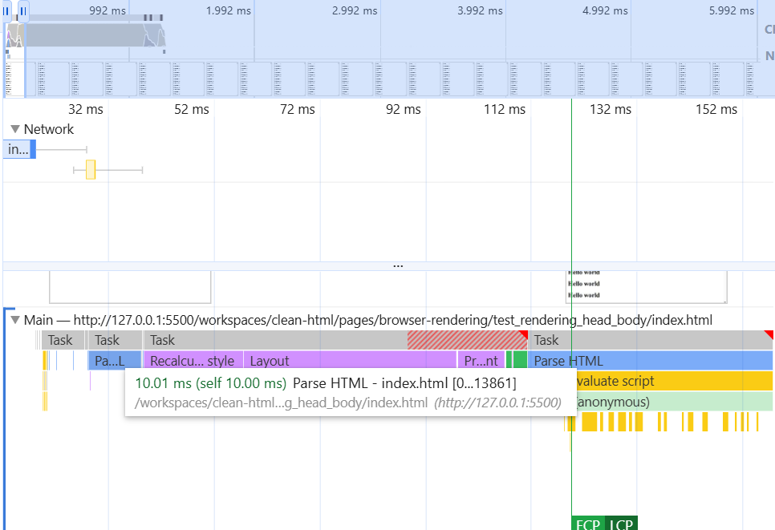

This example shows that browser, particularly Chrome, is rendering document before it parses all document:

Despite the thought that Render tree is constructing only when DOM and CSSOM is completed. It may be some kind of browser optimization of rendering process. 

It also shows that when intermediate render happens only those styles will be applied that where parsed before this render. It will not contain all CSS that is in the document, only those that are parsed at the moment of intermediate render.
