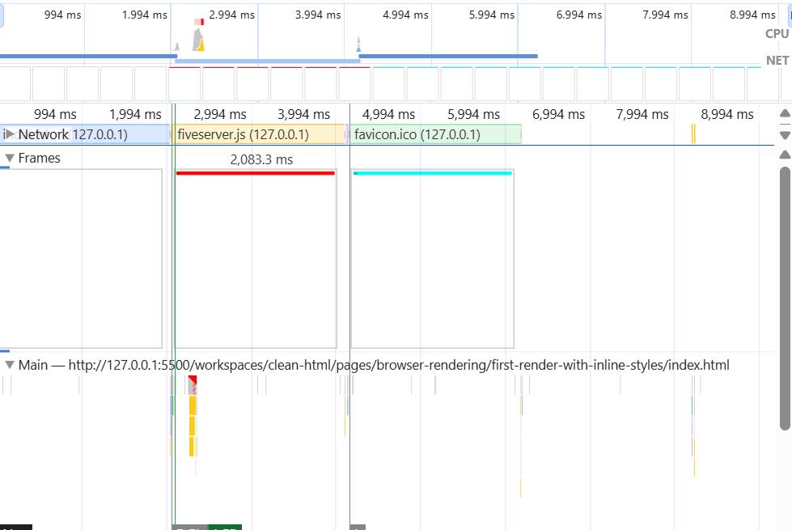
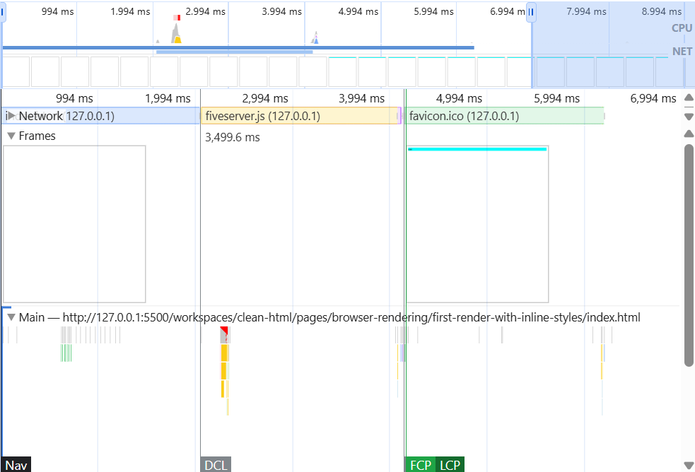

### Comparing first frame time for *inline styles + async loading* vs *inline styles + sync loading*

This example should prove that inline styles can be helpful for the first render if CSS styles are loaded slowly. 

ChatGPT generates CSS to increase the CSS loading time. 

This is how fast the page is loaded when the stylesheet is loaded asynchronously:

Profiling of the same case, but the stylesheet is loaded synchronously:

We can see that the completed page (with all styles) is rendered at the same time in both cases, but in the case of async loading, we have another frame before with just inline styles. 

But we can achieve a similar result by splitting the stylesheet and loading the critical part of the styles synchronously and non non-critical part asynchronously. It would produce almost the same result, but without inline styles.

### Async stylesheet loading 

It is not guaranteed that a link with `media=" print"` will be loaded asynchronously. There was no mention of this behavior anywhere on MDN or some other trusted resource. So, a more robust way of loading styles asynchronously is to use the `disabled` attribute of a `link` element and a script that will remove it after a page is loaded. 

But behavior in this case will be slightly different. Downloading of a stylesheet will only begin after the script removes the `disabled` attribute. 
