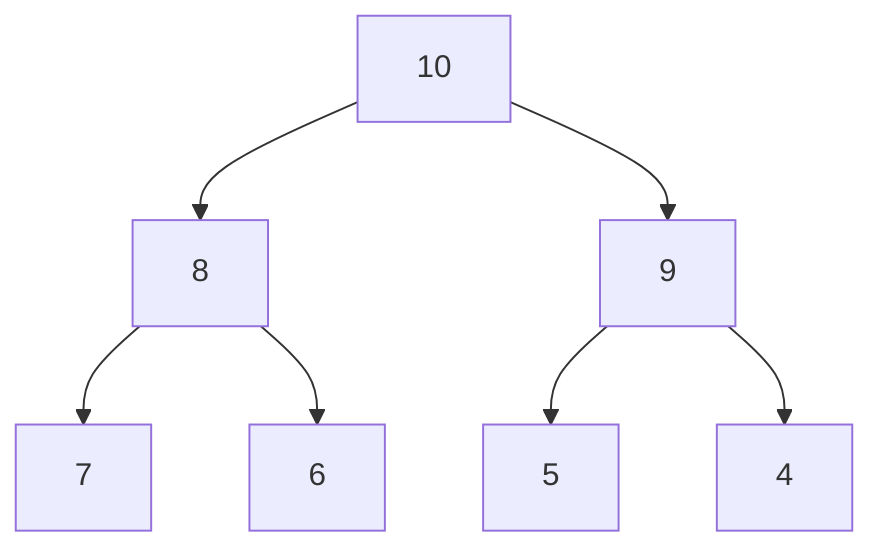

# Heap

## What is a Heap?

A heap is a specialized tree-based data structure that satisfies the heap property:

- Max Heap: For any node C, the key (value) of its parent node P is greater than or equal to the key of C.

- Min Heap: For any node C, the key (value) of its parent node P is less than or equal to the key of C.

Heaps are commonly used to implement priority queues.

## Key Properties

_Complete Binary Tree_: All levels are completely filled except possibly the last one, which is filled from left to right.

_Heap Property_: As mentioned above, either max heap or min heap property is maintained.

## Common Operations

- __Insert__: Add the new element to the end of the heap.

- __Heapify up__: Compare the new element with its parent. If the heap property is violated, swap them and repeat until the heap property is restored.

- __Delete__ (Extract Min/Max): Replace the root (min/max element) with the last element.

- __Heapify__ down: Compare the new root with its children. If the heap property is violated, swap the root with the larger/smaller child and repeat until the heap property is restored.

## Time Complexity

- Insert: O(log n)

- Delete (Extract Min/Max): O(log n)

- Find Min/Max: O(1) (since the min/max element is always at the root)
Applications

- Priority Queues: Heaps are the most efficient way to implement priority queues, where elements are removed in order of their priority.

- Sorting Algorithms: _Heapsort_ is a sorting algorithm that uses a heap to efficiently sort elements.

- Graph Algorithms: Heaps are used in algorithms like Dijkstra's algorithm for finding the shortest path in a graph.

## Example (Max Heap)

